<!-- HERO BANNER -->

  

<!-- TYPING ANIMATION -->

  

<!-- VISITOR COUNTER -->

  

---

<!-- SOCIAL LINKS & CONTACT BADGES -->

  
  
  
  
  
  

 

<!-- ABOUT ME -->

  

<table align="center" width="100%">
  <tr>
    <td>
      
🔭 <b>Current Role:</b> Computer Science Student specializing in <b>Artificial Intelligence & Machine Learning</b>. Designing & engineering robust AI workflows and scalable backend systems.

      
🌱 <b>Learning Focus:</b> MLOps frameworks, high-throughput model serving pipelines, and distributed system design.

      
💡 <b>Core Interests:</b> Deep Learning, Computer Vision, Large Language Models (LLMs), RAG architectures, and microservice backends.

      
⚡ <b>Career Goal:</b> Dedicated AI Engineer & Software Development Engineer (SDE) building next-generation products that solve complex real-world challenges.

    </td>
  </tr>
</table>

 

<!-- CURRENT FOCUS -->

  
<b>🎯 Current Focus Areas (Click to collapse/expand)</b>

   
  <ul>
    <li><b>Face Liveness Detection:</b> Developing anti-spoofing classifiers using Deep CNNs to mitigate print and replay attacks.</li>
    <li><b>RAG Systems:</b> Structuring optimized pipelines using Vector Databases and hybrid dense-sparse retrieval techniques.</li>
    <li><b>LLM Engineering:</b> Developing agentic workflows with LangChain and LlamaIndex to automate backend logical reasoning.</li>
    <li><b>FastAPI Microservices:</b> Designing async RESTful APIs with strict performance optimizations, caching, and rate-limiting.</li>
    <li><b>System Design:</b> Mastering architectural patterns, database indexing strategies, and event-driven architectures.</li>
  </ul>

 

<!-- TECH ARSENAL -->

  

<table align="center" width="100%">
  <tr>
    <td width="30%"><b>💻 Languages</b></td>
    <td>
      
      
      
      
    </td>
  </tr>
  <tr>
    <td><b>🧠 AI & Machine Learning</b></td>
    <td>
      
      
      
      
      
      
    </td>
  </tr>
  <tr>
    <td><b>⛓️ LLM Stack</b></td>
    <td>
      
      
      
      
      
    </td>
  </tr>
  <tr>
    <td><b>⚡ Backend & APIs</b></td>
    <td>
      
      
      
      
    </td>
  </tr>
  <tr>
    <td><b>🗄️ Databases</b></td>
    <td>
      
      
      
      
    </td>
  </tr>
  <tr>
    <td><b>🛠️ DevOps & Linux</b></td>
    <td>
      
      
      
      
    </td>
  </tr>
  <tr>
    <td><b>☁️ Cloud Services</b></td>
    <td>
      
      
    </td>
  </tr>
</table>

 

<!-- FEATURED PROJECTS SHOWCASE -->

  

<table align="center" width="100%">
  <tr>
    <td width="50%" align="center">
      
    </td>
    <td width="50%" align="center">
      
    </td>
  </tr>
  <tr>
    <td width="50%" align="center">
      
    </td>
    <td width="50%" align="center">
      
    </td>
  </tr>
</table>

 

<!-- GITHUB ANALYTICS DASHBOARD -->

  

<!-- Custom Glassmorphic Stats Card (Local & Reliable) -->

  

<!-- Working Dynamic Streak & Activity Widgets -->
<table align="center" width="100%">
  <tr>
    <td width="50%" align="center">
      
    </td>
    <td width="50%" align="center">
      
    </td>
  </tr>
</table>

 

<!-- CONTRIBUTION SNAKE ANIMATION -->
<h3 align="center">🐍 Contribution Snake</h3>

  

 

<!-- CODING PROFILES DASHBOARD -->

  

<table align="center" width="100%">
  <tr>
    <td width="60%" align="center">
      
    </td>
    <td width="40%" align="center">
      
<b>Codeforces &amp; Kaggle Badges</b>

      <a href="https://codeforces.com/profile/ayushX15" target="_blank">
          
      </a>
      
    </td>
  </tr>
</table>

 

<!-- OPEN SOURCE CONTRIBUTIONS -->

  
<b>📂 Open Source Contributions (Click to expand)</b>

   
  <ul>
    <li>Active contributor to ML toolings and microservice backend codebases.</li>
    <li>Optimizing documentation and adding robust unit tests for community projects.</li>
    <li>Find my PRs, issues, and discussions by filtering search filters on GitHub.</li>
  </ul>

 

<!-- MILESTONES, CERTIFICATIONS & TROPHIES -->

  

<!-- Achievements Card -->

  

<table align="center" width="100%">
  <tr>
    <td width="50%">
      <h4>🎓 Certifications</h4>
      <ul>
        <li><b>Deep Learning Specialization</b> (DeepLearning.AI)</li>
        <li><b>AWS Certified Developer / Cloud Practitioner</b></li>
        <li><b>Google Machine Learning Specialization</b></li>
      </ul>
    </td>
    <td width="50%">
      <h4>🏆 Key Milestones</h4>
      <ul>
        <li><b>500+</b> Problems Solved on LeetCode &amp; Codeforces</li>
        <li><b>15+</b> AI/ML Projects Developed from Research to Deploy</li>
        <li><b>10+</b> Scalable Backend APIs &amp; CLI utilities</li>
        <li>Active Open Source Contributor</li>
      </ul>
    </td>
  </tr>
</table>

 

<!-- LEARNING ROADMAP -->

  
<b>🗺️ Current Learning Roadmap (Click to collapse/expand)</b>

   
  <ul>
    <li><b>MLOps:</b> Kubernetes (K8s) deployment, MLflow tracking, and model monitoring dashboards.</li>
    <li><b>Distributed Systems:</b> Database replication, message brokers (Kafka/RabbitMQ), and load balancing.</li>
    <li><b>Advanced LLM serving:</b> Learning optimization libraries like TensorRT-LLM and vLLM to minimize token latency.</li>
  </ul>

 

<!-- DEVELOPER PHILOSOPHY / QUOTE -->

  <i>"Code is cheap, architecture is key. Build systems that are robust, modular, and scale gracefully."</i>

<!-- FUN FACTS -->

  
<b>⚡ Fun Facts (Click to expand)</b>

   
  <ul>
    <li>I implemented simple Feed-Forward Neural Networks from scratch in pure C++ using standard library arrays to understand gradient descent and backpropagation details.</li>
    <li>I enjoy reading complex system design case studies and technical blogs from Netflix, Uber, and Discord.</li>
    <li>I solve coding puzzles and competitive programming problems to keep my analytical skills sharp.</li>
  </ul>

 

<!-- FOOTER BANNER -->

  

