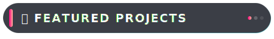
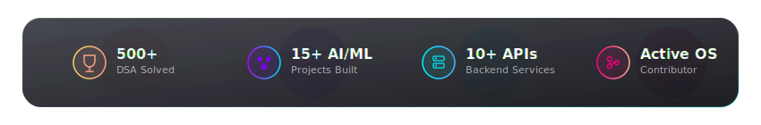

<!-- HERO BANNER -->

  

<!-- TYPING ANIMATION -->

  

<!-- VISITOR COUNTER -->

  

---

<!-- SOCIAL LINKS & CONTACT BADGES -->

  
  
  
  
  

 

<!-- ABOUT ME -->

  

<table align="center" width="100%">
  <tr>
    <td>
      
🔭 <b>Current Role:</b> GenAI Expert Intern @ Al Zoned (Apr 2026 – Present) | B.Tech CSE (AI &amp; ML) @ Sharda University, Greater Noida

      
🌱 <b>Learning Focus:</b> Agentic AI workflows, LangGraph pipelines, FastAPI microservices, and scalable backend architecture.

      
💡 <b>Core Interests:</b> Large Language Models (LLMs), Agentic AI Systems, Computer Vision, Backend Engineering, and Generative AI applications.

      
🛠️ <b>What I Build:</b> LLM-powered automation pipelines, real-time AI chatbots, object detection systems, and backend APIs with Flask &amp; FastAPI.

      
⚡ <b>Career Goal:</b> AI/ML Engineer &amp; SDE building production-grade intelligent systems that solve real-world problems.

    </td>
  </tr>
</table>

 

<!-- CURRENT FOCUS -->

  
<b>🎯 Current Focus Areas (Click to collapse/expand)</b>

   
  <ul>
    <li><b>Agentic AI Pipelines:</b> Building and optimizing multi-node LangGraph workflows for autonomous code and content generation.</li>
    <li><b>LLM Integration &amp; Prompt Engineering:</b> Developing LLM-powered backends using Gemini API and Ollama with structured prompt strategies.</li>
    <li><b>Backend API Development:</b> Designing async RESTful APIs with FastAPI — including polling endpoints, caching, and real-time data surfacing.</li>
    <li><b>Computer Vision Systems:</b> Implementing object detection using MobileNet SSD + OpenCV DNN for real-time, low-latency inference.</li>
    <li><b>AI Automation at Scale:</b> Building end-to-end AI-assisted automation pipelines including web scraping, visual feedback loops, and deployment workflows.</li>
  </ul>

 

<!-- TECH ARSENAL -->

  

<table align="center" width="100%">
  <tr>
    <td width="30%"><b>💻 Languages</b></td>
    <td>
      
      
      
      
      
    </td>
  </tr>
  <tr>
    <td><b>🧠 AI &amp; Machine Learning</b></td>
    <td>
      
      
      
      
      
    </td>
  </tr>
  <tr>
    <td><b>⛓️ LLM Stack</b></td>
    <td>
      
      
      
    </td>
  </tr>
  <tr>
    <td><b>⚡ Backend &amp; APIs</b></td>
    <td>
      
      
      
    </td>
  </tr>
  <tr>
    <td><b>🌐 Frontend</b></td>
    <td>
      
      
    </td>
  </tr>
  <tr>
    <td><b>🗄️ Databases</b></td>
    <td>
      
    </td>
  </tr>
  <tr>
    <td><b>🛠️ Tools &amp; DevOps</b></td>
    <td>
      
      
      
      
    </td>
  </tr>
</table>

 

<!-- FEATURED PROJECTS SHOWCASE -->

  

<table align="center" width="100%">
  <tr>
    <td width="50%" align="center">
      
    </td>
    <td width="50%" align="center">
      
    </td>
  </tr>
  <tr>
    <td width="50%" align="center">
      
    </td>
    <td width="50%" align="center">
      
    </td>
  </tr>
</table>

 

<!-- GITHUB ANALYTICS DASHBOARD -->

  

<!-- Custom Glassmorphic Stats Card (Local & Reliable) -->

  

<!-- Working Dynamic Streak & Activity Widgets -->
<table align="center" width="100%">
  <tr>
    <td width="50%" align="center">
      
    </td>
    <td width="50%" align="center">
      
    </td>
  </tr>
</table>

 

<!-- CONTRIBUTION SPACE SHOOTER -->
<h3 align="center">🛸 Contribution Space Shooter</h3>

  

 

<!-- CODING PROFILES DASHBOARD -->

  

<table align="center" width="100%">
  <tr>
    <td width="60%" align="center">
      
    </td>
    <td width="40%" align="center">
      
<b>Codeforces &amp; Kaggle Badges</b>

      <a href="https://codeforces.com/profile/ayushX15" target="_blank">
          
      </a>
      
    </td>
  </tr>
</table>

 

<!-- OPEN SOURCE CONTRIBUTIONS -->

  
<b>📂 Open Source Contributions (Click to expand)</b>

   
  <ul>
    <li>Active contributor to ML toolings and microservice backend codebases.</li>
    <li>Optimizing documentation and adding robust unit tests for community projects.</li>
    <li>Find my PRs, issues, and discussions by filtering search filters on GitHub.</li>
  </ul>

 

<!-- MILESTONES, CERTIFICATIONS & TROPHIES -->

  

<!-- Achievements Card -->

  

<table align="center" width="100%">
  <tr>
    <td width="55%">
      <h4>🎓 Certifications</h4>
      <ul>
        <li><b>Introduction to Generative AI &amp; ML</b> (2025) — Fundamental concepts of AI, ML, and generative models</li>
        <li><b>Ethics in Engineering Practice — NPTEL</b> (2025) — 8-week IIT Kharagpur certified course</li>
        <li><b>Web Development Training — Internshala</b> (2024) — HTML, CSS, Bootstrap, DBMS, PHP, JavaScript, React</li>
      </ul>
    </td>
    <td width="45%">
      <h4>🏆 Key Milestones</h4>
      <ul>
        <li><b>4+</b> AI/ML &amp; backend projects shipped end-to-end from design to deployment</li>
        <li>Achieved <b>0.98/1.0</b> visual similarity score in autonomous website generation project</li>
        <li><b>GenAI Expert Intern</b> building LLM-powered automation pipelines @ Al Zoned (2026)</li>
        <li>Reduced setup time from <b>~90s to ~5s</b> via caching in WebGen Engine</li>
      </ul>
    </td>
  </tr>
</table>

 

<!-- LEARNING ROADMAP -->

  
<b>🗺️ Current Learning Roadmap (Click to collapse/expand)</b>

   
  <ul>
    <li><b>Advanced LangGraph Patterns:</b> Multi-agent collaboration, memory nodes, and conditional branching in agentic pipelines.</li>
    <li><b>FastAPI at Scale:</b> Background tasks, dependency injection, async patterns, and structured API versioning.</li>
    <li><b>Docker &amp; Containerization:</b> Containerizing Flask/FastAPI applications for reproducible deployments.</li>
    <li><b>Computer Vision Depth:</b> Exploring YOLO architectures and real-time tracking beyond MobileNet SSD.</li>
    <li><b>System Design Fundamentals:</b> Database indexing, REST API design principles, and scalable service architecture.</li>
  </ul>

 

<!-- DEVELOPER PHILOSOPHY / QUOTE -->

  <i>"Code is cheap, architecture is key. Build systems that are robust, modular, and scale gracefully."</i>

<!-- FUN FACTS -->

  
<b>⚡ Fun Facts (Click to expand)</b>

   
  <ul>
    <li>I built an autonomous website generator that runs a Gemini Vision feedback loop — it compares screenshots pixel-by-pixel and revises its own output until it hits a 0.98 visual match.</li>
    <li>I run LLaMA 3 locally via Ollama — no cloud, no API cost, full control. Cortex Chat was built entirely on my own machine.</li>
    <li>I automated real estate lead management with Python cron jobs + Twilio SMS before writing a single line of frontend code — backend-first thinking.</li>
    <li>I care more about architecture than aesthetics: every project I build has a structured folder layout, modular code, and a README before it has a UI.</li>
  </ul>

 

<!-- FOOTER BANNER -->

  

