<!-- HERO BANNER -->

  

<!-- TYPING ANIMATION -->

  

<!-- VISITOR COUNTER -->

  

---

<!-- SOCIAL LINKS & CONTACT BADGES -->

  
  
  
  
  

 

<!-- ABOUT ME -->

  

  

 

<!-- CURRENT FOCUS / WHAT I'M WORKING ON -->

  

  

 

<!-- TECH ARSENAL -->

  

<table align="center" width="100%">
  <tr>
    <td width="28%" nowrap><b>💻 Languages</b></td>
    <td>
      
      
      
      
      
      
      
      
      
    </td>
  </tr>
  <tr>
    <td width="28%" nowrap><b>🧠 AI &amp; Machine Learning</b></td>
    <td>
      
      
      
      
      
      
      
      
      
    </td>
  </tr>
  <tr>
    <td width="28%" nowrap><b>⛓️ LLM Stack</b></td>
    <td>
      
      
      
      
      
    </td>
  </tr>
  <tr>
    <td width="28%" nowrap><b>⚡ Backend &amp; APIs</b></td>
    <td>
      
      
      
      
      
    </td>
  </tr>
  <tr>
    <td width="28%" nowrap><b>🌐 Frontend</b></td>
    <td>
      
      
      
    </td>
  </tr>
  <tr>
    <td width="28%" nowrap><b>🗄️ Databases</b></td>
    <td>
      
    </td>
  </tr>
  <tr>
    <td width="28%" nowrap><b>🛠️ Tools &amp; DevOps</b></td>
    <td>
      
      
      
      
      
      
      
    </td>
  </tr>
</table>

 

<!-- FEATURED PROJECTS SHOWCASE -->

  

<table align="center" width="100%">
  <tr>
    <td width="50%" align="center">
      
    </td>
    <td width="50%" align="center">
      
    </td>
  </tr>
  <tr>
    <td width="50%" align="center">
      
    </td>
    <td width="50%" align="center">
      
    </td>
  </tr>
</table>

 

<!-- GITHUB ANALYTICS DASHBOARD -->

  

<!-- Custom Glassmorphic Stats Card (Local & Reliable) -->

  

<!-- Working Dynamic Streak & Activity Widgets -->
<table align="center" width="100%">
  <tr>
    <td width="50%" align="center">
      
    </td>
    <td width="50%" align="center">
      
    </td>
  </tr>
</table>

 

<!-- CONTRIBUTION SPACE SHOOTER -->
<h3 align="center">🛸 Contribution Space Shooter</h3>

  

 

<!-- CODING PROFILES DASHBOARD -->

  

<table align="center" width="100%">
  <tr>
    <td width="60%" align="center">
      
    </td>
    <td width="40%" align="center">
      
<b>Codeforces &amp; Kaggle Badges</b>

      <a href="https://codeforces.com/profile/ayushX15" target="_blank">
          
      </a>
      
    </td>
  </tr>
</table>

 

<!-- OPEN SOURCE CONTRIBUTIONS -->

  
<b>📂 Open Source Contributions (Click to expand)</b>

   
  <ul>
    <li>Active contributor to ML toolings and microservice backend codebases.</li>
    <li>Optimizing documentation and adding robust unit tests for community projects.</li>
    <li>Find my PRs, issues, and discussions by filtering search filters on GitHub.</li>
  </ul>

 

<!-- CERTIFICATIONS -->

  

<table align="center" width="100%">
  <tr>
    <td>
      <ul>
        <li>🎓 <b>Education for Sustainable Development</b> — NPTEL, IIT Kharagpur (2026) — Sustainable development, SDGs, environmental and social sustainability</li>
        <li>🎓 <b>Ethics in Engineering Practice</b> — NPTEL, IIT Kharagpur (2025) — Engineering ethics, professional responsibility, ethical decision-making</li>
        <li>🎓 <b>Introduction to Generative AI, AI &amp; ML</b> (2025) — AI fundamentals, machine learning, deep learning, LLMs, and generative AI</li>
        <li>🎓 <b>Data Analytics Job Simulation</b> — Deloitte Forage (2025) — Data analysis, forensic technology, business analytics, problem-solving</li>
        <li>🎓 <b>Java Fundamentals</b> — Oracle Academy (2025) — Core Java, OOP, classes, methods, arrays, and programming fundamentals</li>
        <li>🎓 <b>Web Development Training</b> — Internshala (2024) — HTML, CSS, Bootstrap, JavaScript, React, PHP, DBMS, full-stack development</li>
        <li>🎓 <b>WordPress Web Development for Absolute Beginner Zero to Hero</b> — Udemy (2025) — WordPress, themes, plugins, website customization, deployment</li>
      </ul>
    </td>
  </tr>
</table>

 

<!-- DEVELOPER PHILOSOPHY / QUOTE -->

  <i>"Code is cheap, architecture is key. Build systems that are robust, modular, and scale gracefully."</i>

 

<!-- FOOTER BANNER -->

  

